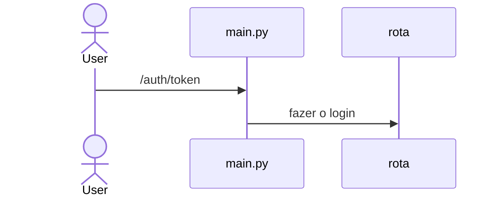

# 📌 Tarefas API – Simulador de CRUD com Web Scraping

API REST desenvolvida com **FastAPI** que realiza web scraping de dados públicos do site [Embrapa VitiBrasil](http://vitibrasil.cnpuv.embrapa.br).  
Inclui endpoints de autenticação e operações CRUD simuladas sobre tarefas e dados coletados.

  


---

## 🧩 Arquitetura da Aplicação

A aplicação segue uma arquitetura modular e limpa, utilizando o framework **FastAPI** para construção de APIs RESTful.

### 🔧 Componentes Principais

- **FastAPI**: Framework principal para criação de APIs rápidas e eficientes.
- **Uvicorn**: Servidor ASGI utilizado para executar a aplicação.
- **BeautifulSoup**: Biblioteca utilizada para realizar o web scraping dos dados públicos do site da Embrapa VitiBrasil.
- **Pydantic**: Utilizado para validação e serialização dos dados.
- **Autenticação JWT**: Implementada para proteger os endpoints da API.

### 📁 Estrutura de Diretórios

A estrutura do projeto está organizada da seguinte forma:

```
tc-embrapa/
├── src/
│   ├── api/               # Definição dos endpoints da API
│   └── auth/              # Implementação da autenticação JWT
│   ├── services/          # Lógica de negócios e web scraping
├── tests/                 # Modelos Pydantic para validação de dados
├── main.py                # Ponto de entrada da aplicação
├── requirements.txt       # Dependências do projeto
├── .env                   # Variáveis de ambiente
└── README.md              # Documentação do projeto
```

Essa organização promove uma separação clara de responsabilidades, facilitando a manutenção e escalabilidade da aplicação.





---

## 🚀 Como Executar

### 1. Clonar o repositório

```bash
git clone https://github.com/papires-linux/tc-embrapa.git
cd tc-embrapa
```

### 2. Configurar variáveis de ambiente

Crie um arquivo `.env` na raiz do projeto com o seguinte conteúdo:

```env
SECRET_KEY=chave-secreta
SECRET_USERNAME=user
SECRET_PASSWORD=user@1234
```

### 3. Executar localmente (sem Docker)

```bash
python -m venv venv
source venv/bin/activate
pip install -r requirements.txt
uvicorn app.main:app --reload
```

Acesse a API em: [http://localhost:8000/docs](http://localhost:8000/docs)

### 4. Executar com Docker

#### Build da imagem

```bash
docker build -t tc-embrapa-api .
```

#### Rodar o container

```bash
docker run -d -p 8000:8000 tc-embrapa-api
```

---

## ✅ Testes e Documentação

- **Swagger UI**: [http://localhost:8000/docs](http://localhost:8000/docs)  
- **ReDoc**: [http://localhost:8000/redoc](http://localhost:8000/redoc)

### Teste de saúde da API

```bash
curl http://localhost:8000/health
```

### Autenticação

```bash
curl -X POST 'http://127.0.0.1:8000/auth/token' \
  -H 'Content-Type: application/x-www-form-urlencoded' \
  -d 'username=admin' \
  -d 'password=1234'
```

Use o `access_token` retornado no header `Authorization: Bearer <token>` para as demais requisições.

---

## 📊 Exemplos de Endpoints

### 🔹 [01] Produção e Comercialização

Consulta por função (`producao` ou `comercializacao`) e ano:

```bash
curl 'http://127.0.0.1:8000/api/<funcao>?ano=<ano>' \
  -H 'Authorization: Bearer <token>'
```
Exemplo:
```bash
curl 'http://127.0.0.1:8000/api/producao?ano=2018' \
  -H 'Authorization: Bearer <token>'
```

### 🔹 [02] Processamento, Importação e Exportação
**Parâmetros disponíveis:**
| Função         | Tipos          |
|----------------|----------------|
| `processamento`| viniferas, americanas_hibridas, uvas_mesa, sem_classificacao |
| `importacao`   | vinhos_mesa, espumantes, uvas_frescas, uvas_passas, suco_uva |
| `exportacao`   | vinhos_mesa, espumantes, uvas_frescas, uvas_passas, suco_uva |

Consulta por função, tipo e ano:

```bash
curl 'http://127.0.0.1:8000/api/<funcao>/<tipos>?ano=<ano>' \
  -H 'Authorization: Bearer <token>'
```

Exemplo:
```bash
curl 'http://127.0.0.1:8000/api/processamento/viniferas?ano=2020' \
  -H 'Authorization: Bearer <token>'
```


---

## 🧪 Tecnologias Utilizadas

- [FastAPI](https://fastapi.tiangolo.com/)
- [Uvicorn](https://www.uvicorn.org/)
- [BeautifulSoup](https://www.crummy.com/software/BeautifulSoup/)
- [Docker](https://www.docker.com/)
- [Python 3.10+](https://www.python.org/)

---

## 👨‍💻 Autor

Desenvolvido por [Paulo Pires](https://github.com/papires-linux) 😉

